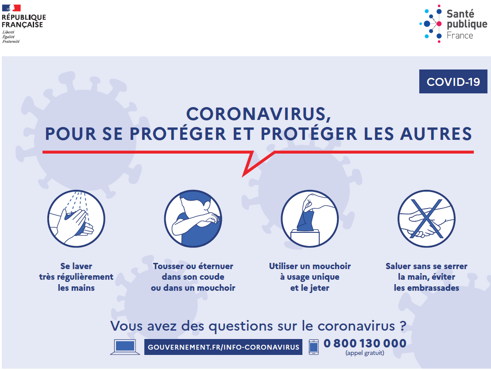

# Est-ce que c'est bientôt le déconfinement (en France) ? 

**Non**.

Aujourd'hui, aucune date n'a encore été avancée, bien que différents plans sont à l'étude par le gouvernement.

# En attendant...

## Les informations utiles (et fiables)

[Site du gouvernementd dédié au COVID-19](https://www.gouvernement.fr/info-coronavirus) :
* Vous trouverez les attestations dérogatoires à imprimer et compléter, en plusieurs format (pdf, docs, txt)
* Les dernières consignes
* Une carte régulièrement actualisée de l'évolution de l'épidémie sur le territoire français.

## Pourquoi le confinement ? 

## Les gestes barrières

_dernière mise à jour_: 03/04/2020
